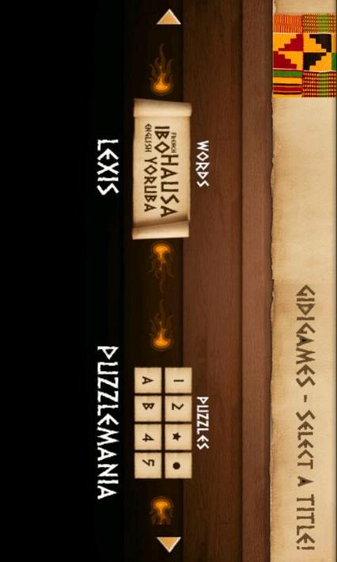
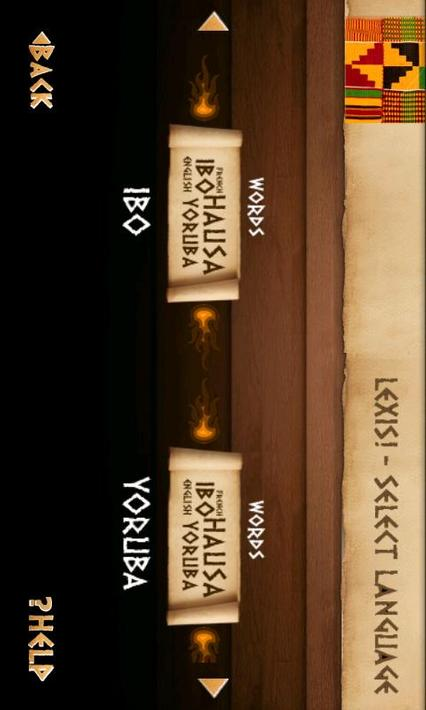
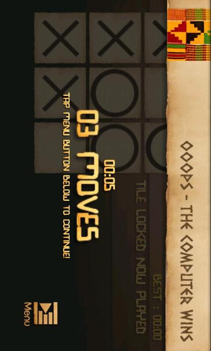
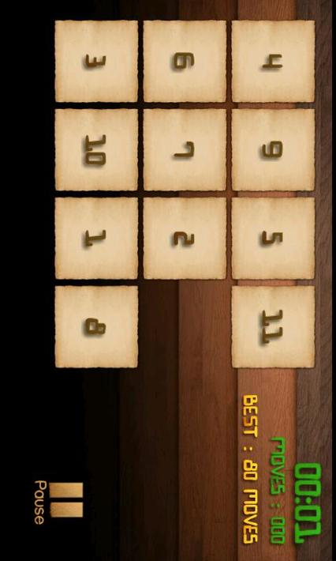

GidiGames
=========

    
    
    
    

A collection of 3 board games done with cocos2d for android. Lexis, TicTacToe, Puzzlemania . Gives basic direction on the use of the cocos2d for android engine.

License
=========

Code in this repository is open-sourced software licensed under the [MIT license](http://opensource.org/licenses/MIT)

Victor Dibia.
